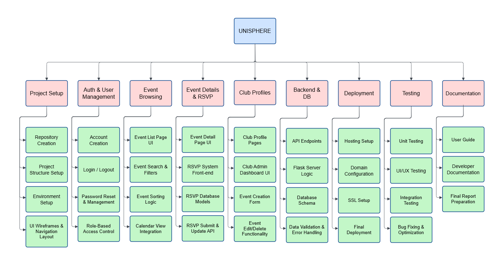

# Project Charter – UniSphere

## 1. Introduction

This project aims to create **UniSphere**, a centralized Campus Event and Club Management Portal that helps students stay connected and clubs manage their activities efficiently. The platform will serve as a hub for posting, managing, and discovering campus events. It will feature event browsing, RSVP functionality, club profiles, and calendar integration to simplify communication between clubs and students while enhancing engagement and participation.

*Date: October 10, 2025* 

*Current Version: 1.0*

*Project Manager (and Sponsor): UniSphere Team* 

---

## 2. Overview

### 2.1 Objectives

The objectives of the UniSphere project are:
- Develop a web-based portal where clubs can create, edit, and manage events.  
- Provide students with an easy-to-use interface to browse events, RSVP, and follow clubs.  
- Ensure seamless authentication for role-based access (student, club admin, platform admin).  
- Implement a reliable backend and secure database for storing users, clubs, and events.  
- Deliver a modern, responsive UI for consistent experience across desktop and mobile devices.  

---

## 3. Milestones

1. **Project Setup & Core UI** – Establish repository, initial project structure, and navigation bar layout.  
2. **Authentication & User Flows** – Implement account creation, login/logout, password management.  
3. **Event Browsing & Search** – Allow students to browse and filter events by category, popularity, or date.  
4. **Event Details & Responsive Design** – Design detailed event pages and ensure mobile-friendly layouts.  
5. **Club Profiles & Admin Dashboard** – Enable clubs to manage their profiles and display events.  
6. **Event Creation & RSVP** – Provide club admins tools to create events and track RSVPs.  
7. **Platform Admin & UI Polishing** – Implement admin panel and refine usability.  
8. **Final Testing & Deployment** – Perform testing, bug fixing, and deploy UniSphere for launch.  

### 3.1 Work Breakdown Structure

### 3.2 Requirements Traceability Matrix

### Requirements Traceability Matrix (RTM)

| Req ID | Requirement | Del ID | Deliverable | Owner | Status |
|--------|-------------|--------|-------------|--------|--------|
| REQ01 | Authentication system allowing users to create accounts and log in | DEL01 | Secure role-based authentication | Jeeya (Back-End Dev) | In Progress |
| REQ02 | Students must be able to browse events and view event details | DEL02 | Event browsing page & event detail pages | Shashini (Front-End Dev) | Pending |
| REQ03 | Club admins should be able to create, edit, and delete events | DEL03 | Club admin dashboard with event management tools | Full Team | Pending |
| REQ04 | Students must be able to RSVP to events | DEL04 | RSVP system integrated with events | Ramandeep (Database Specialist) | Pending |
| REQ05 | Calendar displaying upcoming events | DEL05 | Integrated calendar view | Shashini (Front-End Dev) | Pending |

---

## 4. Deliverables
- **DEL01**: A functional web application hosted on a live server with domain and SSL.  
- **DEL01**: Authentication system for secure account creation, login, and role-based access.  
- **DEL02**: Event browsing, filtering, and details pages for students.  
- **DEL03**: Club profile management and admin dashboard. 
- **DEL04**: RSVP system to track event participation.  
- **DEL05**: Final tested and deployed version of UniSphere accessible to all students.  

### 4.1 Gantt Chart

---

## 5. Preliminary Budget

The UniSphere project follows a Scrum framework with 6 sprints, each lasting 2 weeks.
The team consists of 3 members (Front-End Developer, Back-End Developer, Database Specialist).
Each member works part-time with a daily burn rate based on their role.
Fixed costs cover hosting, domain, SSL, and design tools.
A 10% contingency reserve is included to cover unexpected risks.

| **Category**           | **Description**                                                    | **Cost (CAD)** |
|------------------------|--------------------------------------------------------------------|----------------|
| **Personnel Costs**    |                                                                    |                |
| Sprint Burn Rate       | Avg. $3,000 per sprint per person × 3 team members                | $9,000 / sprint |
| Number of Sprints      | 6 sprints (2 weeks each)                                           | –              |
| **Total Personnel Cost** | 9,000 × 6                                                        | **$54,000**    |
|                        |                                                                    |                |
| **Fixed Costs**        |                                                                    |                |
| Hosting & Server Setup | Cloud hosting (e.g., AWS/Heroku), SSL certificates                | $1,200         |
| Domain Registration    | Domain for UniSphere                                               | $40            |
| Design Tools           | Optional Figma Pro + assets                                        | $300           |
| Backend Tools/Plugins  | API tools, libraries, testing frameworks                           | $500           |
| **Total Fixed Costs**  |                                                                    | **$2,040**     |
|                        |                                                                    |                |
| **Contingency (10%)**  | Applied on Personnel + Fixed costs                                 | **$5,604**     |
|                        |                                                                    |                |
| **Total Estimated Budget** | 54,000 + 2,040 + 5,604                                       | **$61,644**    |

---

## 6. Organization and Stakeholders

### Stakeholder Analysis Matrix

### Communications Plan

| **Information to Communicate** | **Owner** | **Target Stakeholders** | **Schedule / Frequency** | **Communication Channel** |
|--------------------------------|-----------|--------------------------|----------------------------|-----------------------------|
| Project Status & Milestone Progress | Project Manager | College Administration, Platform Admin | Bi-weekly | Email Summary + Optional In-Person Meeting |
| Sprint Progress & Development Updates | Development Team Lead | Club Executives, Faculty Advisors | Weekly (Sprint Review) | MS Teams, GitHub Project Board |
| Feature Releases & System Updates | Back-End Lead | Students Attending Events, Club Members | End of each sprint | UniSphere Portal Announcements + Email |
| System Health, Security & Maintenance Alerts | IT Department / SysAdmins | Project Manager, Platform Admin | Monthly, or as needed during issues | Email + Internal Dashboard |
| Event & Club Activity Report | Club Dashboard Lead | Club Executives, Faculty Advisors | Monthly | UniSphere Admin Dashboard |
| User Feedback & Issue Summary | Front-End / UX Lead | Development Team, Project Manager | Weekly | Feedback Form, GitHub Issues |
| Accessibility & Compliance Review | Accessibility Office | Project Manager, Development Team | Per major release | Email + Review Meeting |
| Branding & Communication Guidelines | Marketing & Communications | Project Manager, Club Executives | At major feature releases | Email + Shared Docs |
| Database Structure & Schema Changes (Events, Clubs, RSVP fields) | Database Specialist | Development Team, Platform Admin | As needed during development | GitHub Documentation + Team Sync |
| Privacy, Data Storage & Protection Standards | Project Manager | IT Department / SysAdmins, Campus Security | Monthly or during updates | Email + Internal Documentation |
| Data Integrity & Validation Rules for Event Submissions | Database Specialist | Club Executives, Faculty Advisors | At the start of new feature work | Email + Shared Guidelines |
| Planned Maintenance Windows & Downtime Notifications | IT Department / SysAdmins | Students Attending Events, Club Members | Before scheduled maintenance | Portal Notification + Email Alert |

---

## 7. Risks, Assumptions, and Constraints

Identified Project Risks

The following risks have been identified based on UniSphere’s technology stack (React, Flask, Database), project deliverables, and the timeline shown in the WBS and Gantt chart.

1.Front-End & Back-End Integration Risk – React, Flask, and the database may fail to integrate smoothly, affecting event loading, RSVP handling, and real-time updates.

2.Authentication & Role-Based Access Risk – Login, signup, and student/club admin/platform admin permissions may not function correctly, blocking access to required features.

3.Database Schema & Data Integrity Risk – Poor schema or inconsistent data structures may cause issues with event creation, RSVP tracking, or club profiles.

4.UI/UX Delay Risk – Event browsing UI, filters, calendar integration, and responsive layout may require more time than estimated, impacting front-end delivery.

5.Deployment & Hosting/SSL Risk – The deployment environment, domain linking, or SSL certification may fail, delaying the release of the final working system.

6.Insufficient Testing Risk – If unit, UI, or integration testing is incomplete, bugs may be discovered late, delaying the final deployment and decreasing reliability.

7.Stakeholder Misalignment Risk – The needs of students, club executives, and administration may shift during the project, causing scope changes or rework.
